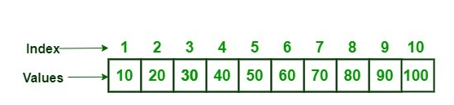
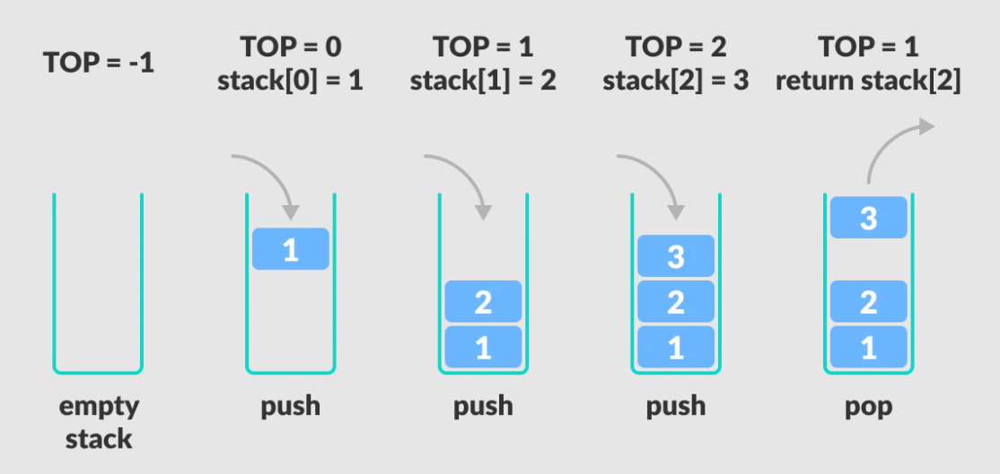
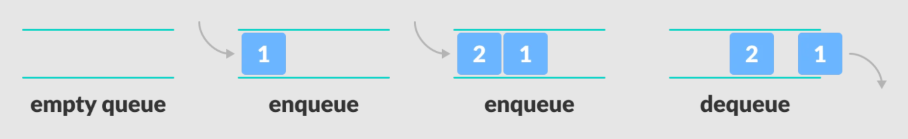
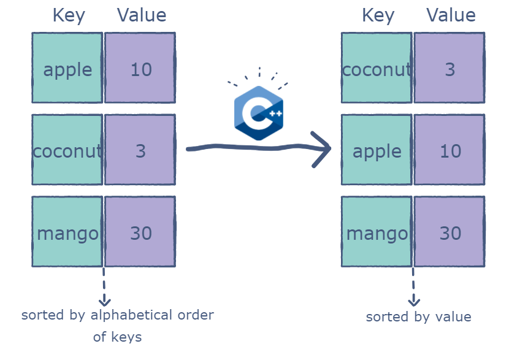

# STL Introduction

1. We were having a  **problem**  so we got data structures
2. **STL** is just an **implementation** for theses data structures
3. All of the data structures:
   - Have almost the same **interface** (functions)
   - But different in the concept of usage

## Vector

## Stack

## Queue

## Map

